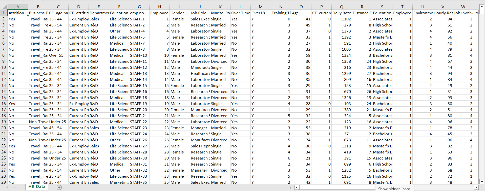
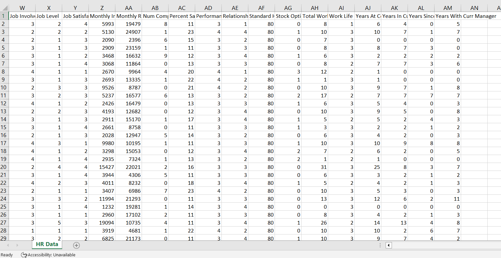
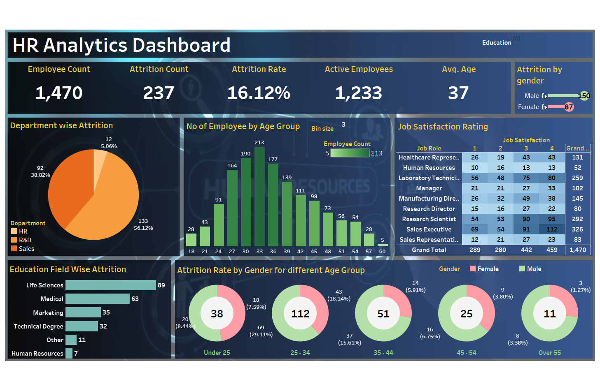

# HR Analytics Using MySQL & Tableau

This project presents an end-to-end **HR Analytics solution** built using **MySQL for data management** and **Tableau for interactive data visualization**. The goal is to analyze employee data and extract meaningful business insights to support HR decision-making.

---

## 📌 Project Objective

- Analyze HR employee data stored in MySQL  
- Identify key workforce trends and patterns  
- Build interactive dashboards using Tableau  
- Generate business reports and presentations for management  

---

## 🧾 Dataset

- HR employee dataset  
- Processed using MySQL  
- Exported as CSV for Tableau visualization  

---

## 🔧 Tools & Technologies Used

- **Database:** MySQL  
- **Visualization:** Tableau  
- **Programming:** Python (Jupyter Notebook)  
- **Documentation:** MS Word, MS PowerPoint  
- **Data Handling:** MS Excel  

---

## 📊 Tableau Dashboard Insights

The Tableau dashboard provides insights on:

- Employee Attrition Analysis  
- Gender Distribution  
- Department-wise Employee Count  
- Salary Trends  
- Experience vs Performance  
- Hiring and Exit Trends  

---

## 🖼️ Project Screenshots

### ✅ Dataset Preview


### ✅ Dataset Overview


### ✅ Tableau Dashboard



---

## 📁 Repository File Breakdown (Flat Structure)

```text
HR-Analytics-Using-MySQL-Tableau/
│
├── IMAGES/                             # Contains all project screenshots
│   ├── dataset_preview.png            # Raw dataset sample preview
│   ├── dataset_overview.png           # Dataset structure & column overview
│   └── tableau_dashboard.png          # Final Tableau dashboard screenshot
│
├── hr_dataset.csv                     # Cleaned HR dataset used for analysis
├── hr_analytics_dashboard.twb         # Main Tableau workbook file
├── hr_analytics_analysis.ipynb        # Python notebook for data preprocessing & analysis
├── hr_analytics_report.docx           # Detailed project report documentation
├── hr_analytics_presentation.pptx     # Final business presentation
│
└── README.md                          # Complete project documentation

```

---

## ✅ Key Outcomes

- Built a complete HR analytics workflow  
- Designed interactive and business-ready Tableau dashboards  
- Delivered a detailed HR analytics report  
- Created a management-level presentation for insights sharing  

---

## 🚀 Future Enhancements

- Live MySQL database connection with Tableau  
- Predictive analytics for employee attrition  
- KPI-based HR monitoring system  

---
